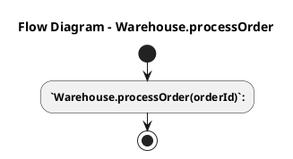
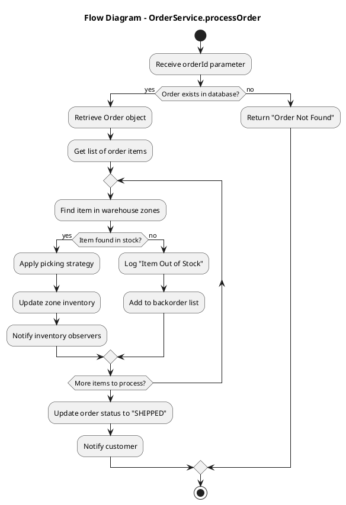
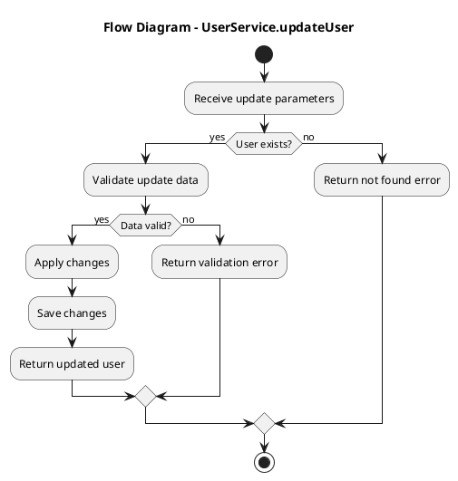

# Enhanced Flow Diagram Generation

## Problem Solved

The original flow diagram generation was too simplistic, producing basic diagrams like:



## Enhanced Solution

The new implementation generates comprehensive activity diagrams with:

### ✅ **Decision Points (if/else)**
```plantuml
if (Order exists?) then (yes)
  :Process order;
else (no)
  :Return "Order Not Found";
endif
```

### ✅ **Loops (repeat/while)**
```plantuml
repeat
  :Find item in zones;
  :Update inventory;
repeat while (More items?)
```

### ✅ **Complex Conditional Logic**
```plantuml
if (Item found?) then (yes)
  :Apply picking strategy;
  :Update zone inventory;
else (no)
  :Log "Item Out of Stock";
endif
```

## How It Works

### 1. **Enhanced Analysis Prompt**
The system now asks Gemini to provide structured flow logic:

```
**Flow Logic:** (IMPORTANT - This section is used for flow diagram generation)
- START: [Initial action]
- DECISION: [Any if/else conditions with yes/no paths]
- LOOP: [Any repeat/while conditions]
- PROCESS: [Main processing steps]
- END: [Final action or return]
```

### 2. **Intelligent Flow Element Extraction**
The system extracts structured flow elements from the analysis:
- **START**: Initial actions
- **DECISION**: Conditional logic with yes/no paths
- **LOOP**: Repetitive operations
- **PROCESS**: Main business logic steps
- **END**: Final actions or returns

### 3. **Smart Pattern Detection**
When structured flow logic isn't available, the system intelligently detects patterns in execution steps:

#### Decision Point Detection:
- Keywords: "check", "validate", "verify", "exists", "if", "condition"
- Generates: `if (condition?) then (yes) ... else (no) ... endif`

#### Loop Detection:
- Keywords: "loop", "iterate", "repeat", "for each", "while"
- Generates: `repeat ... repeat while (condition?)`

#### Method-Based Flow Generation:
Based on method names, generates appropriate flows:

**For `processOrder` method:**
```plantuml
:Receive orderId;
if (Order exists?) then (yes)
  :Process request;
  :Execute business logic;
  :Return result;
else (no)
  :Return error;
endif
```

**For `createUser` method:**
```plantuml
:Receive creation parameters;
:Validate input data;
if (Data valid?) then (yes)
  :Create new entity;
  :Save to database;
  :Return created entity;
else (no)
  :Return validation error;
endif
```

## Expected Output Examples

### Complex Business Flow:


### CRUD Operation Flow:


## Implementation Details

### FlowElement Class
```java
private static class FlowElement {
    String type;        // START, DECISION, LOOP, PROCESS, END
    String description; // The actual flow step description
}
```

### Flow Generation Methods
1. **`extractFlowLogicFromAnalysis()`** - Extracts structured flow logic from Gemini analysis
2. **`generateFlowFromElements()`** - Converts flow elements to PlantUML syntax
3. **`generateFlowFromSteps()`** - Intelligently detects patterns in execution steps
4. **`generateBasicFlow()`** - Creates method-appropriate flows when no details available

### Pattern Matching
- **Decision Keywords**: check, validate, verify, exists, if, condition
- **Loop Keywords**: loop, iterate, repeat, for each, while
- **Method Patterns**: process*, create*, update*, delete*, get*, find*

## Benefits

### ✅ **Accurate Representation**
- Shows actual business logic flow
- Includes decision points and error handling
- Represents loops and iterations

### ✅ **Multiple Fallback Levels**
1. Structured flow logic from Gemini analysis
2. Pattern detection in execution steps
3. Method-name-based flow generation
4. Generic fallback flow

### ✅ **Comprehensive Coverage**
- Handles complex business processes
- Supports CRUD operations
- Manages error conditions
- Shows alternative paths

The enhanced flow diagram generation now produces meaningful, accurate activity diagrams that truly represent the code execution flow with proper decision points, loops, and conditional logic!